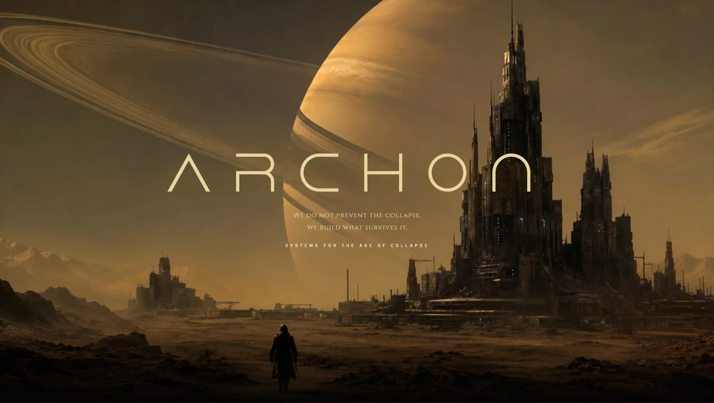

# ARCHON — VideoScroll Demo

**Live demo:** https://viseni.com/_demos_/archon/



A cinematic scroll-driven video sequence demo. As the user scrolls, a 241-frame WebP image sequence plays back frame-by-frame over a full-viewport canvas, creating the illusion of a video controlled entirely by scroll position.

## What It Does

The hero section pins to the viewport while the user scrolls. Each pixel of scroll advances the frame sequence forward, synchronized via GSAP ScrollTrigger's `scrub`. Below the pinned hero, standard content sections animate in with scroll-triggered entrance effects.

> If this tool saves you time, consider supporting its development — every contribution funds more experiments and free tools for the community. ☕
>
> <a href="https://www.buymeacoffee.com/drlerian" target="_blank"></a>

## Tech Stack

| Library | Version | Role |
|---|---|---|
| [GSAP](https://gsap.com) | 3.12.5 | Animation engine, ScrollTrigger, scrub |
| [Lenis](https://lenis.darkroom.engineering) | 1.1.14 | Smooth scroll inertia |
| Google Fonts | — | Cinzel + Rajdhani typefaces |
| Custom font | `fonts/Dune_Rise.otf` | Display heading font |

No build step. Single HTML file + assets.

## How the Scroll Video Works

```
sequence/seq000.webp → seq240.webp   (241 frames, zero-padded)
```

All frames preload into an `Image[]` array on page load. A `<canvas>` covers the full hero. GSAP animates a `state.frame` value from `0` to `240` tied to scroll position via `ScrollTrigger` with `scrub`. On each update, the current frame is drawn to the canvas with cover-fit scaling.

The hero is **pinned** for the full scroll distance of the sequence:

```js
end: '+=' + (FRAME_COUNT - 100) * (isMobile ? 22 : 10)
// ~1410px desktop, ~3102px mobile scroll travel
```

Hero text elements (title, subtitle, CTA) scroll at independent `yPercent` parallax rates over that same distance, creating depth separation from the canvas.

## Sections (after the pin releases)

| Section | Entrance animation |
|---|---|
| **Protocols** (4 cards) | 3D perspective rise + per-card flip stagger |
| **Counters** | Clip-path bottom wipe + animated number count-up |
| **Marquee** | Infinite horizontal loop, cinematic zoom-out entrance |
| **Big Lines** | Per-line blur-drop reveal + amber underline draw |

## Project Structure

```
index.html          — entire demo (HTML + CSS + JS, no build)
fonts/
  Dune_Rise.otf     — custom display font
sequence/
  seq000.webp       — frame 0
  seq001.webp       — frame 1
  ...
  seq240.webp       — frame 240 (241 total)
```

## Running Locally

Open `index.html` directly in a browser, or serve via any static file server to avoid CORS issues with local font loading:

```bash
npx serve .
# or
python -m http.server 8080
```

## Frame Sequence Requirements

- Format: WebP (recommended for size/quality)
- Naming: `seq000.webp` → `seq240.webp` (3-digit zero-padded)
- Place in `sequence/` folder
- Frame count controlled by `FRAME_COUNT = 241` in the script

To change frame count, update `FRAME_COUNT` and adjust the image sequence accordingly.

## Mobile Behavior

- Lenis smooth scroll enabled on touch with reduced multiplier (`0.4`)
- Scroll travel per frame increased (`×22` vs `×10` desktop) for comfortable thumb-scroll pacing
- Card grid collapses to single column
- Typography scales down via `clamp()`
- `prefers-reduced-motion`: all animations skip, loader hides instantly
